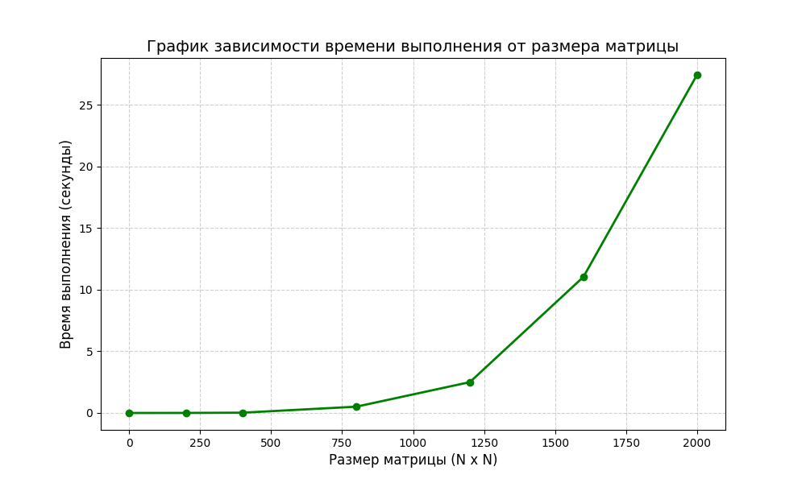

# Лабораторная работа №1: Умножение квадратных матриц

## Описание работы
Реализована программа для перемножения двух квадратных матриц размера N×N. Проведена автоматизированная верификация результатов с помощью библиотеки NumPy (Python).

## Результаты экспериментов

### Таблица замеров времени

| Размер матрицы (N) | Время выполнения (с) |
|-------------------|----------------------|
| 0                 | 0.0000000            |
| 200               | 0.0054683            |
| 400               | 0.0726069            |
| 800               | 0.9512300            |
| 1200              | 2.9034300            |
| 1600              | 8.3992000            |
| 2000              | 36.7616000           |

P.S.: Для всех размеров матриц верификация результатов вычислений прошла успешно.

### График зависимости времени выполнения от размера матрицы

## Выводы

1. **Характер зависимости**: Время выполнения растёт нелинейно (кубично) с увеличением размера матрицы. 

2. **Малые размеры (N <= 400)**: При небольших размерах матриц время выполнения пренебрежимо мало (менее 0.08 с), что делает вычисления практически мгновенными.
**Средние размеры (N = 800-1200)**: Можно заметить рост времени выполнения (с 0.95 до 2.90 с). Алгоритм начинает требовать существенных вычислительных ресурсов. **Большие размеры (N >= 1600)**: Время выполнения возрастает экспоненциально (8.40 с для N=1600 и 36.76 с для N=2000).

3. При больших объёмах вычислений становится очевидной потребность в распараллеливании процессов. 
