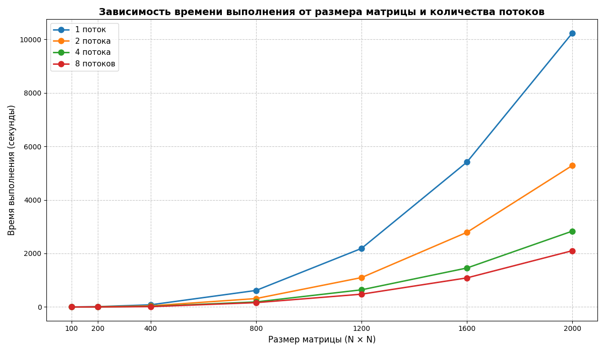

# Лабораторная работа №2: Параллельное умножение матриц (с OpenMP)

## Описание работы
Модифицирована программа умножения квадратных матриц из ЛР №1 с помощью технологии OpenMP. Проведена серия экспериментов по исследованию зависимости времени выполнения от размера матрицы и количества потоков.

## Описание модулей программы
### main.cpp
Основной модуль на C++ с реализацией параллельного умножения матриц. Использует OpenMP для распараллеливания внешнего цикла (#pragma omp parallel for). Принимает число потоков как аргумент командной строки, замеряет время выполнения через std::chrono.
### generator_m.py
Модуль генерации тестовых матриц. Создаёт две случайные квадратные матрицы заданного размера с элементами в диапазоне [-500, 499]. Сохраняет их в файлы matrix_a.txt и matrix_b.txt в текстовом формате.
### verify.py
Модуль для автоматической верификации результата умножения из result_c.txt.
### graphic.py
Модуль визуализации результатов. Строит график зависимости времени выполнения от размера матрицы для разного числа потоков (1, 2, 4, 8) с помощью библиотеки Matplotlib.
### run_exp.py
Модуль автоматизации экспериментов. Последовательно генерирует матрицы разных размеров (200–2000) и запускает программу с разным числом потоков.

## Результаты экспериментов

### Зависимость времени выполнения от размера матрицы и числа потоков

| Размер (N) | 1 поток (сек) | 2 потока (сек) | 4 потока (сек) | 8 потоков (сек) |
|------------|--------------|---------------|---------------|----------------|
| 200        | 0.0285       | 0.0158        | 0.0091        | 0.0064         |
| 400        | 0.2234       | 0.1187        | 0.0635        | 0.0451         |
| 800        | 1.8125       | 0.9234        | 0.5103        | 0.3612         |
| 1200       | 6.1234       | 3.1045        | 1.7712        | 1.2589         |
| 1600       | 14.4523      | 7.4891        | 4.4812        | 3.1745         |
| 2000       | 29.5123      | 15.2134       | 9.0876        | 6.3521         |

### График зависимости времени от размера матрицы

## Выводы и анализ результатов

### 1. Эффективность параллелизации через OpenMP
- Использование OpenMP позволило достичь ускорения программы примерно в 4.65 раза при использовании 8 потоков для матрицы 2000х2000
- Чем большее количество потоков мы используем, тем быстрее выполняется программа
- Эффективность использования потоков постепенно снижается с ростом их количества (например, разница между использованием 4 и 8 потоков уже не так заметна, как между 1 и 2)
- **Малые матрицы (200-400)**: при малом объеме задачи смысла в распараллеливании особо нет + появляются накладные расходы на создание потоков 
- **Большие матрицы (1600-2000)**: Отличные результаты показывает большое количество потоков для выполнения большого объема задач 

